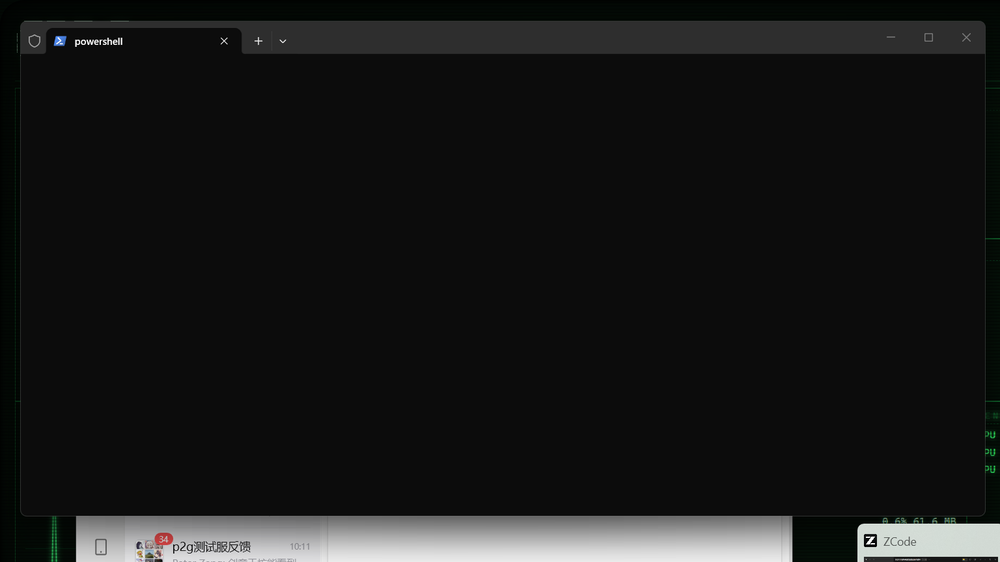

# CRT-Monitor

复古 CRT 风格的副屏系统监控仪表盘。**v1.1**：**Web 远看**（局域网浏览器实时查看）、SMART 磁盘健康、温度历史曲线 + 热力图温度模式、天气 AQI、历史导出 CSV、拖拽对齐辅助线、快捷键帮助（?）、主题定时轮换；托盘常驻、告警中心、音频频谱、媒体卡音量、Ping 监控、系统事件、远程多机、自由布局、卡片管理器、布局预设、主题编辑器、11+ 套主题、C#/JS 插件。免管理员安装。



## Web 远看

默认开启（`"web_port": 8080`，0 关闭）。同一局域网的手机/平板/电脑浏览器打开：

```
http://<本机IP>:8080/
```

即得实时只读仪表盘（SSE 推送，1 秒刷新）。首次使用需在 Windows 防火墙放行 8080 端口（设置 → 防火墙 → 入站规则，或弹窗时允许）。

## 快捷键

| 键 | 作用 |
|---|---|
| `Tab` / `Shift+Tab` | 切换页面 |
| `P` | 切换布局预设（config `profiles` 定义了 ≥2 组时生效） |
| `E` | **布局编辑模式**：拖面板移动；任意边/角调整宽高；吸附 2% 网格自动保存 |
| `C` | **卡片管理器**（编辑模式内）：ON/OFF 切换卡片、THEMES 区点选主题、✎ 打开主题编辑器 |
| `S` | 截图 |
| `G` | 导出 24h 历史 CSV 到 `图片\CRT-Monitor\` |
| `?` | 快捷键帮助浮层 |
| `F11` | 全屏 ⇄ 窗口化 |
| `Esc` | 隐藏到托盘（彻底退出用托盘右键菜单 → 退出） |
| `R` | 重载前端 |
| `A` | 开机自启开关 |
| `T` | 循环切换主题 |
| `1` / `2` / `3` | 内建主题：磷光绿 / 琥珀 / 纸白 |

 防灼屏靠整页低频微抖（`burnin: always`），无独立屏保。托盘左键切换显隐，右键可导出/导入 config.json（换机/分享布局主题）。

## 主题定时轮换

```json
{ "theme_schedule": [
  { "from": "07:00", "to": "19:00", "theme": "green" },
  { "from": "19:00", "to": "07:00", "theme": "amber" }
] }
```

每 30 秒检查，进入时段自动切换（支持跨零点）；手动换的主题会在下一个检查点被时段规则接管。

## 面板

| id | 页面 | 内容 |
|---|---|---|
| `cpu` | SYS | 总占用 + 每核示波器曲线 + 实时频率 |
| `heatmap` | SYS | CPU 每核热力图（一格一核，亮度=占用） |
| `mem` | SYS | RAM / SWAP 条形图 |
| `disk` | SYS | 各盘容量条 + 读写速率（WMI，不可用时显示 —） |
| `leds` | SYS | 磁盘活动指示灯（R/W 两颗，IO 时点亮） |
| `net` | SYS | 上下行双曲线 + 实时速率 |
| `proc` | SYS | 进程 Top 8（CPU 排序，同名合并，如 `chrome x4`）。**编辑模式下点两下行 = 结束该进程**（系统关键进程受保护） |
| `sensors` | SYS | CPU/GPU 温度 + GPU 负载（LibreHardwareMonitor，需提权） |
| `alertlog` | SYS | 告警记录中心（最近 30 条，持久化；触发时另有气泡通知） |
| `clock` | LIFE | 大号时钟 + 日期星期 |
| `weather` | LIFE | 当前天气（Open-Meteo 免 key，ip 自动定位，15 分钟刷新） |
| `weather3` | LIFE | 未来 3 天预报（高/低温 + 图标） |
| `hist24` | HIST | 历史曲线，1H/6H/24H/7D 档位 + 昨日同时段虚线对比 |
| `stats` | HIST | 峰值/均值 + 今日上/下行流量累计 |
| `media` | LIFE | 正在播放：标题/艺术家/进度；**滚轮调系统音量** |
| `ping` | NET | Ping 延迟/丢包曲线（config `pings` 定义目标） |
| `netnic` | NET | 分网卡速率（每行一块网卡） |
| `events` | HIST | 系统事件卡（最近 24h 错误/警告） |
| `gpu` | SYS | GPU 负载/温度/显存（需 LHM 提权） |
| `boot` | LIFE | 本次开机时间 / 上次关机时间 / 运行时长 |
| `spectrum` | LIFE | **音频频谱**（24 频段 + 峰值帽，config `"spectrum": true` 启用） |
| `scripts` | SYS | 脚本数据源输出（见下方"脚本文本源"） |
| `remote` | SYS | 远程机器 CPU/内存（见下方"远程监控"） |
| `battery` | LIFE | 电池（**示例插件**，由 plugins/ 加载，台式机显示 N/A） |

## Ping 监控

```json
{ "pings": [
  { "name": "网关", "host": "192.168.1.1", "interval_sec": 2 },
  { "name": "外网", "host": "223.5.5.5", "interval_sec": 2 }
] }
```

## 布局预设

```json
{
  "profiles": [
    { "name": "WORK",  "pages": [ { "name": "SYS", "widgets": [...] } ] },
    { "name": "SHOW",  "pages": [ { "name": "LIFE", "widgets": [...] } ] }
  ],
  "profile": "WORK"
}
```

`P` 键循环切换（写回 config.json）。配置了 profiles 时以预设的 pages 为准（顶层 `pages` 忽略）。

## 远程多机监控

被监控端（另一台 Windows 机器）运行：

```powershell
CrtMonitor.exe --serve
# 数据暴露在 http://127.0.0.1:9123/metrics/（LAN 访问需防火墙放行 9123）
```

监控端副屏机器的 config.json：

```json
{ "remotes": [ { "name": "htpc", "url": "http://192.168.1.20:9123/metrics/" } ] }
```

`remote` 卡片显示各远程机 CPU/内存，断连 10 秒后显示 OFFLINE。

## 脚本文本源

把任意命令的输出变成仪表盘卡片（stdout 首行作为值）：

```json
{ "scripts": [
  { "name": "tmp", "cmd": "powershell -c [int](Get-CimInstance Win32_VideoController).DriverVersion", "interval_sec": 30 }
] }
```

## 卡片参数（cardconf）

```json
{ "cardconf": { "proc": { "count": 12 } } }
```

目前支持：`proc.count`（进程榜条数，默认 8）。

## 音频频谱

config.json 加 `"spectrum": true` 启用（WASAPI loopback 采集系统输出，15Hz FFT，少量 CPU）。卡片管理器开启 `SPECTRUM` 卡即可随音乐起舞；无声音时自动衰减归零。

## 进程管理

编辑模式（E）下进程卡每行可点：**第一下变红确认（3 秒超时取消），第二下结束该名称的全部进程**。受保护名单：system/csrss/winlogon/lsass/svchost/explorer/dwm 等及监控自身，拒绝并提示 PROTECTED。结果经托盘式提示条回显（KILLED x N / NOT FOUND）。

## 扩展机制

**主题**：exe 同目录 `themes/*.json`，字段 `{"id","name","vars":{...},"effects":{...可选}}`，启动自动扫描，`T` 键循环切换并持久化。`vars` 除五个色阶（`--phos/--phos-bright/--phos-dim/--phos-faint/--bg`）外还可设 `--glow`（辉光强度，默认 60%）和 `--radius`（面板圆角）；`effects` 让主题自带特效参数（如现代风关闭扫描线/闪烁/暗角/弯曲），切走自动还原全局设置。内置：磷光绿 / 琥珀 / 纸白；主题目录 8 套：`ocean` 海蓝、`red` 红色警戒、`ice` 冰蓝、`violet` 紫罗兰、`gold` P3 金黄、`magenta` 等离子粉、`sepia` 怀旧褐、`modern` 现代简约（蓝灰 + 圆角 + 无 CRT 特效）。

**插件**（两个维度，可只用其一）：
- C# 采集器：`plugins/*.dll`，实现 `CrtMonitor.Collectors.ICollector`（参考 `plugins-src/BatteryPlugin`，注意 ProjectReference 加 `Private="false"`），宿主反射加载
- 前端面板：`plugins/*.js` 纯 ES module，调用 `CRT.registerWidget({id, title, span?, create})`（参考 `plugins/battery.js`），宿主映射到 `https://plugins.local/` 动态 import

**告警**（config.json `alerts` 数组，触发时顶部红色闪烁横幅 + 日志，`alert_sound: true` 蜂鸣）：

```json
{
  "alert_sound": false,
  "alerts": [
    { "metric": "cpu.usage",    "op": ">", "value": 90, "seconds": 10, "cooldown": 300 },
    { "metric": "mem.used_pct", "op": ">", "value": 92, "seconds": 30, "cooldown": 600, "label": "内存" },
    { "metric": "sensors.cpu_temp", "op": ">", "value": 85, "seconds": 15, "cooldown": 300, "label": "CPU温度" }
  ]
}
```

可用 metric 路径：`cpu.usage`、`mem.used_pct`、`mem.swap_used_pct`、`net.rx_bps`、`net.tx_bps`、`sensors.cpu_temp`、`sensors.gpu_temp`、`disk.<盘符>.used_pct`（如 `disk.C.used_pct`）。

## 技术栈

- **壳**：C# WinForms + WebView2（.NET 8）——无边框全屏，自动选择副屏，阻止系统息屏
- **前端**：Vite + TypeScript + 原生 Canvas，无框架，构建产物 < 10KB
- **采集**：P/Invoke（`NtQuerySystemInformation` / `CallNtPowerInformation` / `GlobalMemoryStatusEx`）+ BCL（`NetworkInterface` / `DriveInfo`），单轮采集 < 1ms

## 安装 / 卸载（用户级，免管理员）

```powershell
# 1. 构建发布包（自包含 ~175MB，目标机无需安装 .NET）
scripts\build-release.cmd

# 2. 安装到 %LOCALAPPDATA%\CrtMonitor + HKCU Run 自启 + 开始菜单快捷方式
scripts\install.cmd

# 卸载（删自启键/快捷方式/程序目录）
scripts\uninstall.cmd
```

安装后开机自启；运行中按 `A` 可随时切换自启（会同步写回安装目录的 config.json）。

## 开发环境

工具链全部装在用户目录（`%USERPROFILE%\.tools\`），**不需要管理员权限**：

- Node（zip 解压）：`%USERPROFILE%\.tools\node`
- .NET 8 SDK（dotnet-install 脚本）：`%USERPROFILE%\.tools\dotnet`

新开的 shell 若找不到命令，把以上两个目录加入 PATH（已通过 setx 持久化，重开终端生效）。

## 常用命令

```powershell
# 前端：纯浏览器调试（自动使用模拟数据，无需启动壳）
npm run dev

# 前端：构建
npm run build

# 壳：编译并运行（会自动把 ../dist 拷进输出目录 wwwroot/）
cd app
dotnet run

# 壳：开发模式（热更新，需要先 npm run dev）
#   在 exe 同目录放 config.json: { "dev_url": "http://localhost:5173" }
#   然后 dotnet run

# 发布单目录
cd app
dotnet publish -c Release -o publish
```

## 配置（exe 同目录 config.json，均可省略）

```json
{
  "refresh_ms": 1000,
  "theme": "green",
  "pages": [
    { "name": "SYS",  "layout": ["cpu", "mem", "disk", "net", "proc", "sensors"] },
    { "name": "LIFE", "layout": ["clock", "weather"] }
  ],
  "effects": { "scanline": 0.35, "flicker": true, "vignette": 0.55, "curvature": true },
  "weather": { "enabled": true, "lat": null, "lon": null, "place": null },
  "lhm": false,
  "autostart": null
}
```

- `refresh_ms`：采集与推送间隔（最小 250）
- `theme`：`green` / `amber` / `white`，运行中 `1`/`2`/`3` 热切换
- `pages`：多页面定义，Tab 循环切换；每页为 `{"name", "widgets":[{"id","x","y","w","h"}], "hidden":["id",...]}` 百分比自由布局（编辑模式拖拽/卡片管理器自动写回；`hidden` 记录主动关闭的卡片）。旧格式 `{"name","layout":["cpu",...]}` 读取时自动转为两列流式布局
- `effects`：扫描线不透明度（0-1）、闪烁开关、暗角强度（0-1）、屏幕弯曲模拟
- `weather`：Open-Meteo 免 key；不填 `lat/lon` 时 ip 自动定位，15 分钟刷新，失败静默退避
- `lhm`：启用 LibreHardwareMonitor（CPU/GPU 温度、GPU 负载）。需要管理员：启动时会弹一次 UAC 重启自身，拒绝则无传感器（面板显示提示）；`autostart` + `lhm` 同时开启意味着每次开机会有 UAC 弹窗，介意可保持 `lhm: false`
- `autostart`：`true`/`false` 写/删 HKCU Run 自启键；`null`（缺省）= 不管理注册表，由安装脚本或 `A` 键控制
- `alerts` / `alert_sound`：见上方"告警"
- `dev_url`：开发模式加载 Vite dev server 而非 wwwroot

## 扩展

- **新指标面板**：后端写一个 `ICollector` 实现加进 `Scheduler`；前端在 `src/widgets/` 写一个模块并 `registerWidget`，在 `main.ts` import。协议字段见 `app/Dtos.cs` 与 `src/lib/types.ts`（一一对应）。
- 数据协议 `version: 1`，新增字段需可选，破坏性变更递增版本。

## 已知边界

- 磁盘读写速率走 WMI，服务被禁用时自动降级为 `—`
- 温度/GPU 依赖 LibreHardwareMonitor（MPL 2.0），需管理员加载 WinRing0 驱动；本仓库构建/集成已完成，未提权时 SENSORS 面板显示提示而不是报错
- 自由布局为百分比等比缩放：窗口缩得很小时窄面板内的长文本会截断（面板 overflow hidden）
- 布局允许面板重叠（自由摆放的设计取舍）；新面板/插件未写进页面配置时自动追加到页面底部
- Tab 切页会重建 widget（示波器历史重新累积），属预期行为
- `crt.log` 在 exe 目录，记录异常/关闭原因/布局与自启变更
